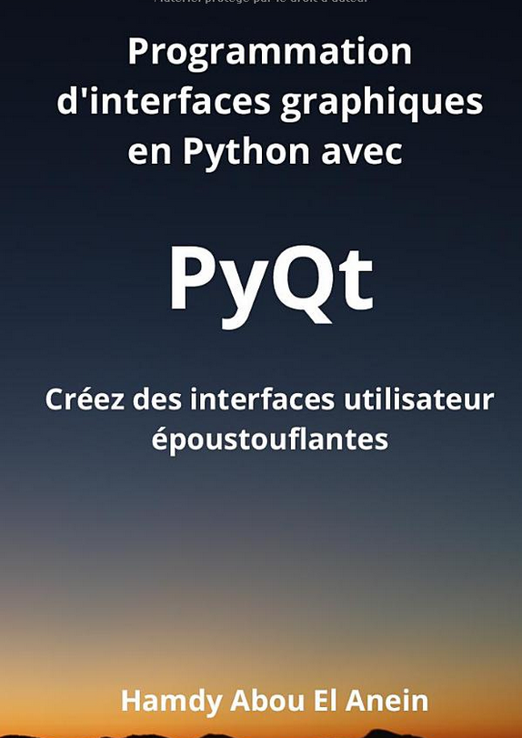

# Programmes du livre : [Programmation d’interfaces graphiques en Python avec PyQt: Créez des interfaces utilisateurs époustouflantes](https://www.amazon.fr/Programmation-dinterfaces-graphiques-Python-avec/dp/B0C1JD2XGK/ref=tmm_pap_swatch_0?_encoding=UTF8&qid=1681563554&sr=8-4)      
       

Auteur : [Hamdy Abou El Anein](https://www.amazon.fr/Hamdy-Abou-El-Anein/e/B0BM89T88X/ref=aufs_dp_fta_dsk)    

